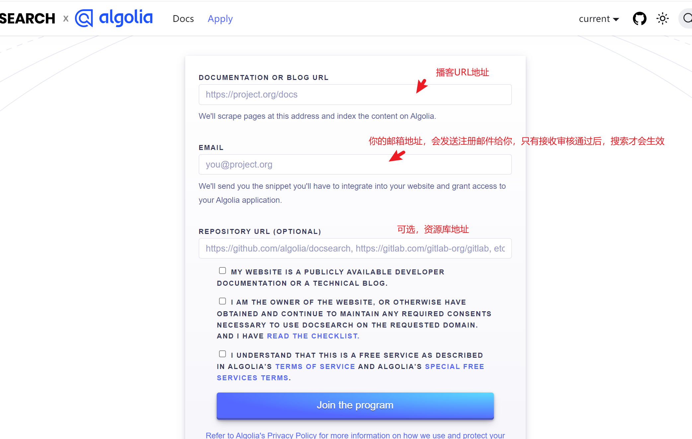
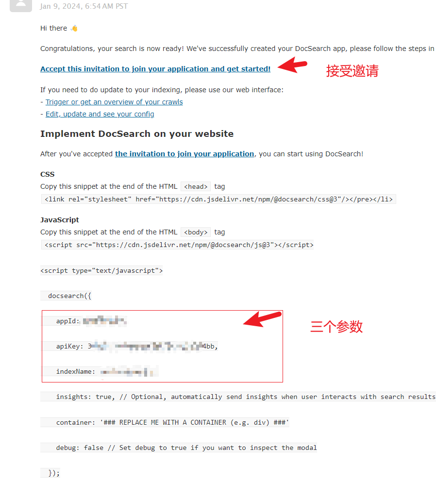
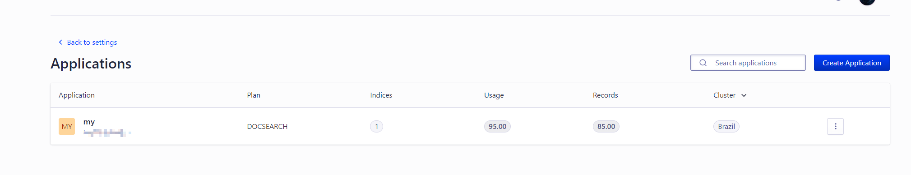
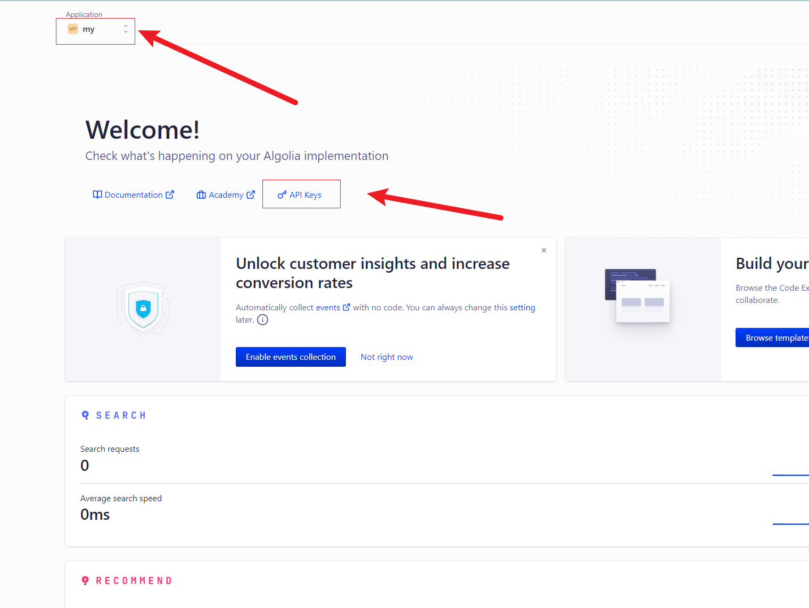
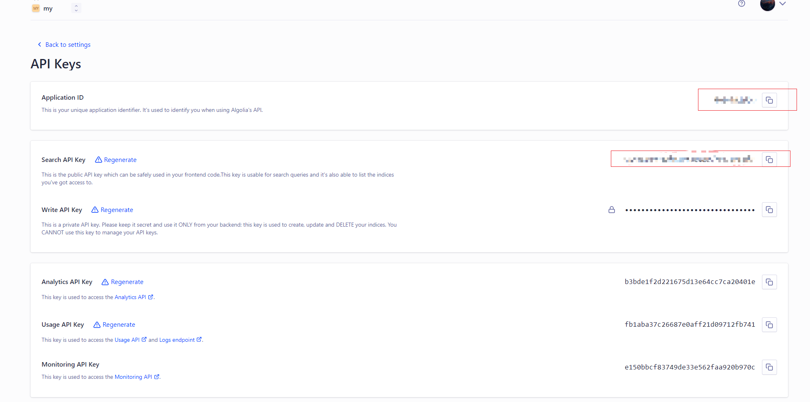
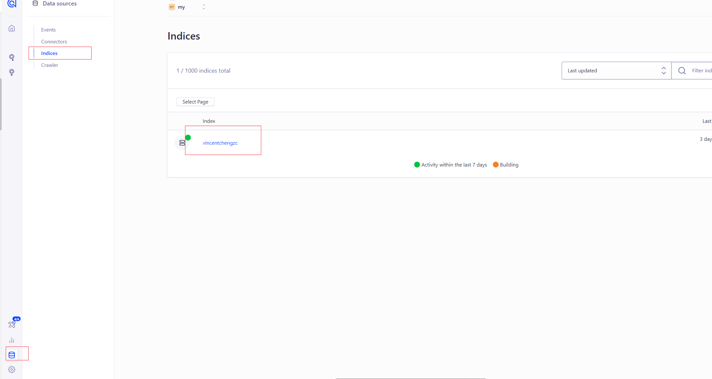

最近折腾 `VitePress`，想给自己的博客添加一个 `algolia`搜索，

> 发现网上很多文章，还是基于老版本的 `vitepress`使用 `github-Actions`的CI自动爬取数据来实时更新

目前最新版本 `VitePress` 支持使用 [Algolia DocSearch](https://link.zhihu.com/?target=https%3A//vitepress.dev/reference/default-theme-search%23algolia-search) 搜索您的文档站点

避免大家被误导，所以写这个文章，避免踩坑

## 使用 Algolia

### 1. 申请使用Algolia DocSearch

[docsearch 申请地址](https://link.zhihu.com/?target=https%3A//docsearch.algolia.com/apply/)



这里有几点需要注意：

* 您必须是该网站的所有者，或至少有更新其内容的权限
* 你的网站必须是公开的
* 你的网站必须是一个开源项目或技术博客的技术文档，不授权于商业内容
* 你的网站必须到生产环境

---

**申请成功后，Algolia官方会给你填写的邮箱发送邮件，提醒你接受邀请，申请成功的邮件如下：**



**点击该地址会让你注册账号登录Algolia，或者第三方选项登录，我个人是以 `GitHub` 身份登录**

---

**成功登录会进入控制台页面，之后来到 Applications 这里，去创建一个应用，以我自己的为例，下图已经创建好了「vitepress」。**

> 注意 如果是点击邮件里的邀请地址，Algolia会默认创建好一个 `应用`，如果没有，自己单独创建一个即可。 :::



---

### 2. 配置

VitePress 支持使用 Algolia DocSearch 搜索您的文档站点，只需要在 `.vitepress/config.js`，配置Algolia参数即可

### 2.1 获取应用的key

如图下所示，进入 API Keys 页面。



进入该页面后，你会看见 `Application ID`和 `Search API Key`，这个2个参数就是我们需要在 `.vitepress/config.js`配置文件的参数



而 `indexName`参数可以在邮件查看，也可以在控制台搜索里查看



---

### 2.2 VitePress配置Algolia

```js
import { defineConfig } from 'vitepress'

export default defineConfig({
  themeConfig: {
    search: {
      provider: 'algolia',
      options: {
        appId: '...', // 你的 Application ID
        apiKey: '...', // 你的Search API Key
        indexName: '...' // 你的indexName
      }
    }
  }
})
```

更多的配置可以查看 `docsearch` [API Reference](https://link.zhihu.com/?target=https%3A//docsearch.algolia.com/docs/api)

---

## 结尾

其实 `vitepress` 官方的本地搜索，已经很不错了，但algolia搜索更全面和强大一些。`
