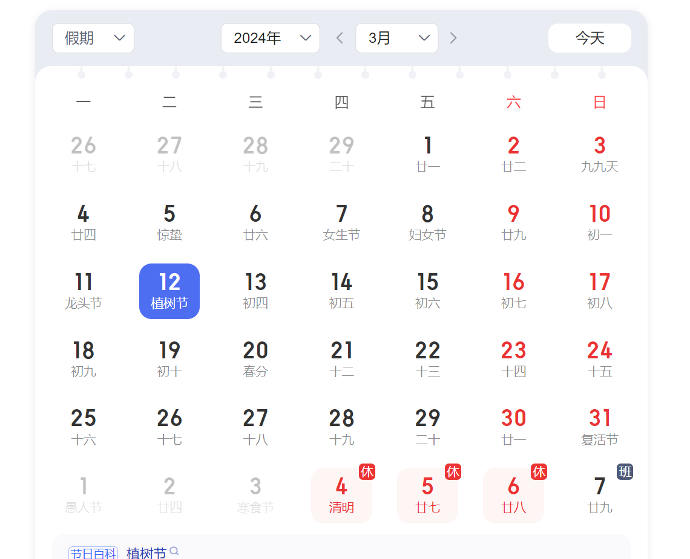
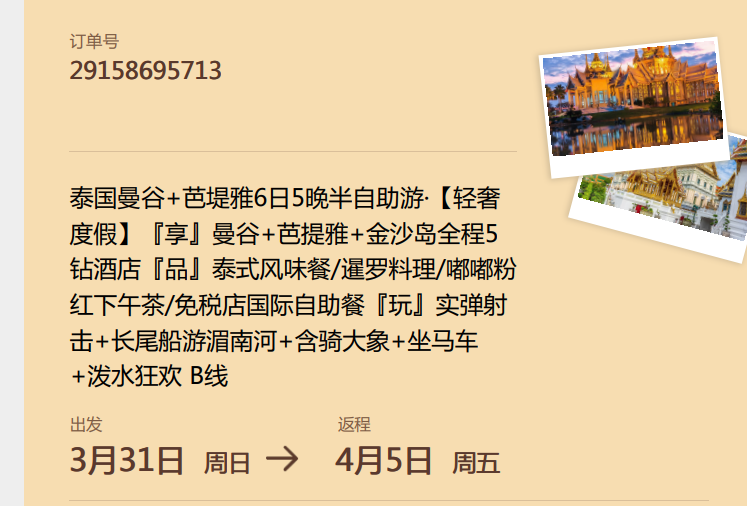

# 泰国行

### 1.3月-4月日期

---

[汇率换算](http://www.baidu.com/link?url=fKqoozv4FwYlMFhhTJJ3HPOriTUuffz3uVsQ9J2LKNg373oTincPgyRm3VyaZ6g5mLcfOKOtq6ZwKhC7Zqc_9okAGr5ZM8WQFWSQehphv4pcpnyF__6XqpaOgIBJ7xfy)1 人民币 ≈ 4.8677 泰铢

---

#### 违约：

* 旅行社违约：
* 旅行社向旅游者退还已收取的全部旅游费用，并按下列标准向旅游者支付违约金：
* 行程前行程前29-15日，退还全额旅游费用，支付旅游费用总额5%的违约金。
* 行程前行程前14-7日，退还全额旅游费用，支付旅游费用总额20%的违约金。
* 行程前行程前6-4日，退还全额旅游费用，支付旅游费用总额50%的违约金。
* 行程前行程前3-1日，退还全额旅游费用，支付旅游费用总额60%的违约金。
* 行程前行程开始当日，退还全额旅游费用，支付旅游费用总额70%的违约金。
* 
* 如按上述比例支付的违约金不足以赔偿旅游者的实际损失，旅行社应当按实际损失对旅游者予以赔偿。
* 
* 旅游者违约：
* 在行程前解除合同的，必要的费用扣除标准为：
* 行程前行程前29-15日，收取旅游费用总额5%的违约金。
* 行程前行程前14-7日，收取旅游费用总额20%的违约金。
* 行程前行程前6-4日，收取旅游费用总额50%的违约金。
* 行程前行程前3-1日，收取旅游费用总额60%的违约金。
* 行程前行程开始当日，收取旅游费用总额70%的违约金。

### 2.行程

---

#### 第一天 3.31

8:00 提前两个小时到达机场

10:00 到机场自行办理登机牌 抵达曼谷机场** *3小时飞机***左右到达曼谷

13:00【专车·泰语司机】接送到酒店

绿宝石酒店

* 国际酒店通常入住时间为下午
  **14：00**，退房时间为次日中午**12：00**，**14：00**至**次日12：00**期间入住皆
* 若由于航班延误或过关时间过长导致长时间无法会合司机的，请第一时间主动联系对方告知相关情况，以便司机或接机调度做好协
  调安排。
* 3.今天的行程只有接机。餐食自理**（全天不含餐）**
* 全天自由活动

---

#### 第二天 4.1

##### 【曼谷→芭堤雅】大皇宫→玉佛寺→长尾船→国际人妖秀→The One Ratchada火车夜市→入住芭提雅5钻酒店

8:00 酒店早餐 **（含餐）**

9:00【大皇宫】【玉佛寺】

11:00 长尾船

12:00 午餐自助餐 **（含餐）**

14:00 罗马金歌舞人妖秀

15:00 火车夜市美食小吃

18:00 晚餐 **（不含餐）**

20:00 前往酒店 ：绿宝石酒店

---

#### 第三天 4.2

##### 皇家珠宝展示中心→毒蛇研究中心→暹罗爽泰庄园（含骑大象+坐马车+泼水）→入住芭提雅5钻酒

8:00 酒店早餐 **（含餐）**

10:00 泰国皇家珠宝中心

12:00  午餐-聚鑫餐厅 **（含餐）**

**14:00 【毒蛇研究中心】**

16:00【 泰国芭提雅爽泰度假庄园】

18:00 暹罗料理 **（含餐）**

20:00 黄金仲天海滩酒店

---

#### 第四天 4.3

##### 金沙岛→嘟嘟粉红下午茶→兰坡海边鱼市→入住芭提雅5钻酒店

8:00 酒店早餐 **（含餐）**

09:00 ： 阁兰岛  可自费参与各项水上活动：降落伞空中遨游（途经水
上平台 ）、也可参加水上电单车、香蕉船、海底漫步、骑摩托艇等等，费用自理

12:00  午餐享用 岛下简餐 **（含餐）**

14:00【Dudu beach club嘟嘟粉红下午茶】

15:00 【兰坡海边鱼市】挑选好海鲜后在海边附近有可以在许多餐厅加工

18:00 晚餐可自由选择在鱼市品尝泰国特色料理 **（含餐）**

20:00 黄金仲天海滩酒店

---

#### 第五天 4.4

##### **健康睡眠中心→实弹射击→寺庙祈福→Kingpower国际免税店→JODD FAIRS DanNeramit城堡夜市**

7:30 酒店早餐 **（含餐）**

09:00【健康睡眠中心】购物店

11:00 【实弹射击】

12:00 享用泰式风味 **（含餐）**

13:00【祈福寺】

14:00【Kingpower国际免税店】购物

18:00 免税店国际自助餐 **（含餐）**

20:00 曼谷莱森特酒店

---

#### 第六天 4.5

##### 【曼谷✈温馨的家】（珍藏旅行记忆，期待下一次相聚）曼谷→24H送机→温馨的家

9:00 酒店早餐 **（含餐）**

基本全天自由活动

前往景点： 唐人街
前往景点： 曼谷大桥
前往景点： 湄南河畔步行区
前往景点： 曼谷玩偶博物馆/13656710【泰国,曼谷,邻铃区】
全天自动活动，以上为推荐景点产生费用自费，根据贵宾航班司机接送
